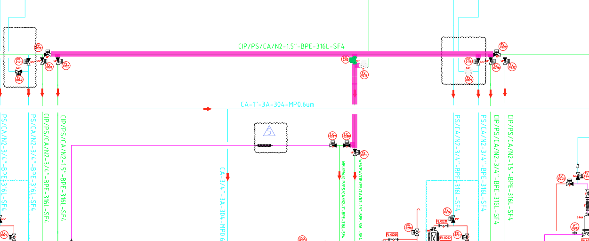
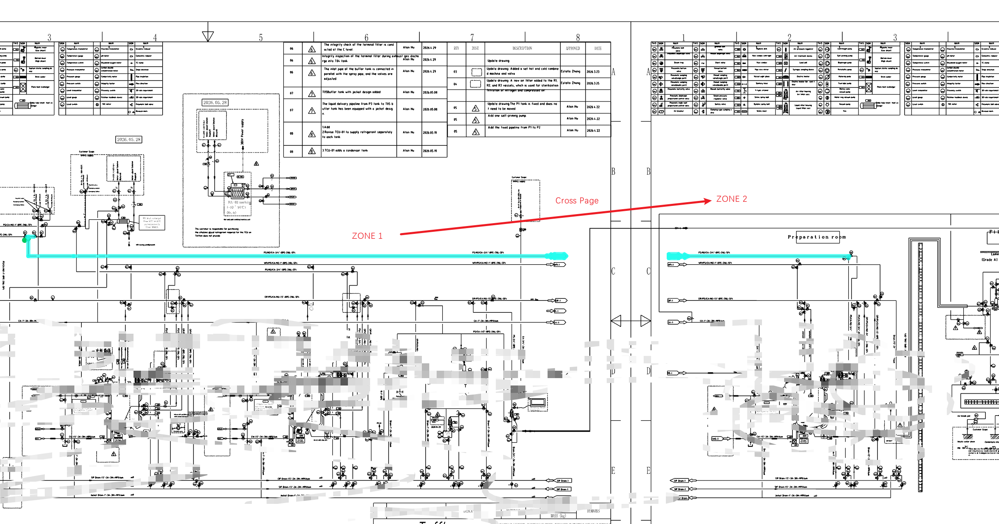

# P&ID 高亮、跨图纸高亮及 PDF 导出需求确认

## 1. PDF 中的高亮样式

当前系统支持配置阀门及流路线条的高亮颜色、透明度和线宽，导出 PDF 时将使用系统中已配置的高亮样式。

请确认附件或示例中所展示的 PDF 高亮效果是否符合预期。

## 2. PDF 背景颜色

导出的 PDF 应采用以下哪种方式？

- 保留原始 P&ID 图纸颜色 ?
- 还是将 P&ID 背景转换为黑灰或灰度，仅保留配置的高亮颜色，以增强对比度？（图中PDF背景是黑灰的模式）?

## 4. 跨 Page 的高亮场景

我们准备了一个参考样例：同一个 P&ID DWG 中包含两个 Zone（Zone 1 和 Zone 2），流路通过唯一的连接 Tag 从一个 Zone 延续到另一个 Zone，并在两个 Zone 中持续高亮。

1：请确认该方式是否符合对 cross-page highlight 的定义？
2：当某个 Phase 跨越这两个 Zone 时，应导出一个包含两个页面的 PDF，还是两个独立的单页 PDF？

## 5. 按容器撬装和步骤浏览集成 P&ID

关于以下需求：

> User should be able to browse any step of any cycle dedicated to a specific vessel skid based on step selection drop-down option in case of integrated P&ID.

我们目前的理解是：在集成 P&ID 场景中，用户可以针对特定的 vessel skid，浏览与其关联的 cycle 和 step，并通过下拉列表选择某个 step。选择后，系统在 P&ID 上显示或高亮该 step 对应的设备和流路。

为了明确 vessel skid、cycle、step 与现有 phase 数据之间的关系，并确保交互方式符合预期，希望进一步确认：

- 特定的 vessel skid 应如何确定：由用户通过单独的下拉列表选择，还是根据当前打开的集成 P&ID 自动确定？
- vessel skid 与 cycle、step 之间的关联关系由什么数据定义？该映射是否由现有配置文件或 P&ID Tag 信息提供？
- 此处的 step 是否等同于当前系统中的 phase？如果不是，请说明 step 与 phase 的区别及关联关系。
- 下拉列表应直接显示该 skid 关联的所有 cycle 和 step，还是采用“先选择 cycle，再选择 step”的两级选择方式？
