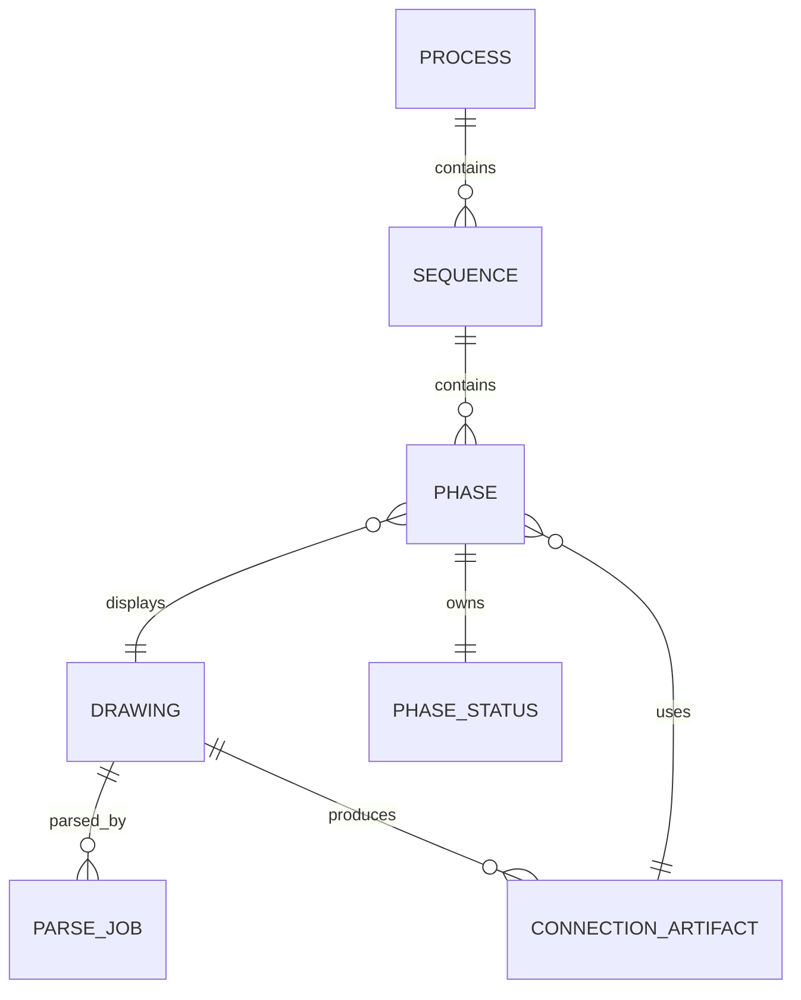
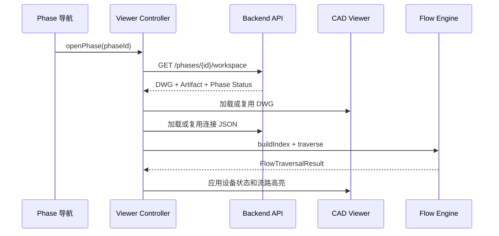

# P&ID Viewer 前后端 API 设计

## 1. 文档目的

本文档定义 P&ID Viewer 前端与后端之间的接口，以及前端内部 Viewer、流路引擎和状态管理模块之间的接口。

本设计以《高亮流路软件用户需求规格说明书（URS）》为依据，适用于以下业务流程：

1. 用户上传 DWG 图纸。
2. 后端异步解析不可变的 DWG，生成连接关系 JSON。
3. 用户创建 Process、Sequence 和 Phase。
4. 每个 Phase 关联指定版本的 DWG 和连接关系 JSON。
5. 前端根据连接关系 JSON 在本地遍历通路并高亮流路。
6. 后端保存 Phase 状态，并生成 PDF 报告和阀门矩阵。

## 2. 设计边界

### 2.1 后端职责

- 管理不可变的 DWG 文件和解析结果。
- 调用 DWG 解析器生成连接关系 JSON。
- 管理 Process、Sequence 和 Phase。
- 保存每个 Phase 的 Phase Status，包括设备状态、流路定义、人工连接、标注和条件。
- 管理 PDF 报告、阀门矩阵、权限和审计记录。

### 2.2 前端职责

- 显示当前 Phase 对应的 DWG。
- 加载该 DWG 版本对应的连接关系 JSON。
- 建立 Handle 邻接索引并在浏览器中计算流路。
- 根据阀门状态、人工连接和远程连接决定遍历范围。
- 显示流路高亮、设备状态、容器液位、标注和步骤条件。
- 将用户输入的 Phase 状态提交给后端。

后端不提供流路计算 API。可由连接关系和 Phase 状态推导出的 `visitedHandles`、`traversedEdges` 等结果不保存到数据库。

## 3. 核心数据关系



一个 Phase 工作区由以下内容组成：

```text
Phase Workspace
├── Phase 基本信息
├── Drawing
│   └── 不可变 DWG 文件
├── Connection Artifact
│   └── 连接关系 JSON
└── Phase Status
    ├── 开放边界
    ├── 设备状态
    ├── 流路定义
    ├── 人工连接
    ├── 标注
    └── 步骤条件
```

多个 Phase 可以引用同一 Drawing 和 Connection Artifact，但每个 Phase 必须拥有独立的 Phase Status。上传新 DWG 时创建新的 Drawing，不覆盖已有 Drawing。

## 4. 通用约定

### 4.1 基础路径

```text
/api/v1
```

### 4.2 请求头

```http
Content-Type: application/json
Authorization: Bearer <access-token>
X-Request-Id: <uuid>
```

### 4.3 标识符

- 数据库对象 ID 使用 UUID 或具有类型前缀的唯一字符串。
- CAD Handle 在 API 中统一使用大写十六进制字符串，例如 `1A3F`。
- 时间使用 ISO 8601 UTC 格式，例如 `2026-08-17T08:30:00Z`。

### 4.4 并发控制

Process、Sequence 和 Phase 等可编辑对象包含整数 `version`。更新请求必须携带当前版本，更新成功后版本加一。

版本不匹配时返回：

```http
409 Conflict
```

## 5. 图纸 API

### 5.1 创建图纸

```http
POST /api/v1/drawings
```

**作用：** 创建一份不可变的 Drawing 记录并获得 DWG 上传地址。每次上传新 DWG 都创建新的 Drawing；已有 Drawing 的文件内容不能替换。

请求：

```json
{
  "drawingNumber": "PID-1001",
  "name": "CIP Supply",
  "sourceSystem": "AUTOCAD",
  "fileName": "PID-1001.dwg",
  "fileSize": 18592734,
  "sha256": "4f55..."
}
```

`sourceSystem` 可取 `AUTOCAD`、`PLANT3D` 或 `COMOS`。

返回：

```json
{
  "drawingId": "drawing_123",
  "uploadSessionId": "upload_123",
  "uploadUrl": "https://storage.example/upload/...",
  "uploadMethod": "PUT",
  "requiredHeaders": {
    "Content-Type": "application/acad"
  },
  "expiresAt": "2026-08-17T12:00:00Z"
}
```

前端应将文件直接上传到 `uploadUrl`，上传文件本身不经过业务 API 服务。`uploadUrl` 仅表示上传授权已经签发，不表示上传已经完成。上传成功后必须调用上传完成确认接口。

服务端应校验文件扩展名、允许的最大文件大小和请求中的 SHA-256。文件内容创建后不可覆盖；重新上传必须创建新的 Drawing。

### 5.2 重新获取上传地址

```http
POST /api/v1/drawings/{drawingId}/upload-url
```

**作用：** 原上传地址过期或尚未使用时，为处于 `PENDING`、`UPLOADING` 或可重试 `FAILED` 状态的 Drawing 重新签发短期上传地址。已经完成上传的 Drawing 不允许再次上传文件内容。

请求：

```json
{
  "uploadSessionId": "upload_123"
}
```

### 5.3 确认上传完成

```http
POST /api/v1/drawings/{drawingId}/upload-complete
```

**作用：** 通知后端文件已经直传到对象存储。后端必须检查对象是否存在，并校验文件大小、文件类型和 SHA-256；校验成功后才将上传状态设置为 `COMPLETED`。

请求：

```json
{
  "uploadSessionId": "upload_123",
  "etag": "storage-etag",
  "fileSize": 18592734,
  "sha256": "4f55..."
}
```

返回：

```json
{
  "drawingId": "drawing_123",
  "uploadStatus": "COMPLETED",
  "verifiedAt": "2026-08-17T12:01:30Z"
}
```

该接口应支持幂等调用。同一 `uploadSessionId` 和校验值重复确认时返回同一结果；校验值不一致时返回冲突错误。

### 5.4 中止上传

```http
POST /api/v1/drawings/{drawingId}/upload-abort
```

**作用：** 中止尚未确认完成的上传，清理对象存储中的未完成对象，并将上传状态设置为 `ABORTED`。浏览器取消上传后应调用此接口；已完成上传不能中止。

### 5.5 查询图纸列表

```http
GET /api/v1/drawings?keyword=PID-1001&uploadStatus=COMPLETED&parseStatus=SUCCEEDED&page=1&pageSize=20
```

**作用：** 查询不可变图纸，并支持按图号、名称、文件名、来源系统、上传状态和解析状态筛选。列表项应返回当前上传状态、最新解析任务摘要、可用 Connection Artifact 和是否允许删除。

### 5.6 查询图纸详情

```http
GET /api/v1/drawings/{drawingId}
```

**作用：** 返回图纸元数据、上传状态、最新解析状态、质量检查摘要、当前可用的 Connection Artifact 和 Phase 引用数量。

上传和解析使用相互独立的状态：

```text
uploadStatus: PENDING | UPLOADING | VERIFYING | COMPLETED | FAILED | ABORTED
parseStatus:  NOT_STARTED | QUEUED | PARSING | NORMALIZING | SUCCEEDED | FAILED | CANCELLED
```

对象存储直传的字节进度由浏览器上传 API 计算，后端只保存上传生命周期状态。前端可以根据两个状态组合显示 `UPLOADING`、`PROCESSING`、`READY` 或 `FAILED`。

### 5.7 更新图纸信息

```http
PATCH /api/v1/drawings/{drawingId}
```

**作用：** 修改图纸名称、图号等元数据，不修改已上传的 DWG 文件内容。

### 5.8 获取 DWG 下载地址

```http
GET /api/v1/drawings/{drawingId}/download-url
```

**作用：** 返回短期有效的 DWG 下载地址，供前端 P&ID Viewer 加载图纸。

返回：

```json
{
  "url": "https://storage.example/download/...",
  "etag": "4f55...",
  "expiresAt": "2026-08-17T12:10:00Z"
}
```

只有上传校验完成的 Drawing 才能获取下载地址。

### 5.9 删除图纸

```http
DELETE /api/v1/drawings/{drawingId}
```

**作用：** 删除未被任何 Phase、已发布 Process 或正式报告引用的 Drawing，并清理其文件、解析任务和未被引用的 Connection Artifact。存在业务引用时返回 `409 Conflict` 及引用摘要，不允许级联删除 Phase。

建议生产环境采用软删除保留审计记录；对象存储文件根据数据保留策略异步清理。

## 6. DWG 解析 API

### 6.1 创建解析任务

```http
POST /api/v1/drawings/{drawingId}/parse-jobs
```

**作用：** 将已上传的 Drawing 提交给后端解析 Worker。该接口立即返回任务 ID，不等待解析完成。同一个 Drawing 可因失败重试或解析器升级产生多个 Parse Job，但 DWG 文件保持不变。

只有 `uploadStatus=COMPLETED` 的 Drawing 才能创建解析任务。`force=false` 且相同解析器配置已经生成可用 Artifact 时，服务端应返回已有结果或冲突提示，避免重复解析；`force=true` 用于失败重试或解析器升级。

请求：

```json
{
  "parserProfile": "PID_DEFAULT",
  "force": false
}
```

返回：

```http
202 Accepted
```

```json
{
  "jobId": "parse_123",
  "status": "QUEUED"
}
```

### 6.2 查询解析任务

```http
GET /api/v1/parse-jobs/{jobId}
```

**作用：** 查询 DWG 解析进度、当前阶段、告警和错误信息。前端可轮询此接口，也可以通过 SSE 接收任务状态。

返回：

```json
{
  "id": "parse_123",
  "status": "PARSING",
  "progress": 65,
  "stage": "BUILDING_CONNECTION_GRAPH",
  "warnings": []
}
```

状态可取：

```text
QUEUED | PARSING | NORMALIZING | SUCCEEDED | FAILED | CANCELLED
```

### 6.3 查询图纸的解析任务列表

```http
GET /api/v1/drawings/{drawingId}/parse-jobs?page=1&pageSize=20
```

**作用：** 返回指定 Drawing 的全部解析历史，包括解析器版本、配置、触发人、状态、耗时、错误和产生的 Artifact。前端使用该接口展示重试和版本演进记录。

### 6.4 订阅解析任务事件

```http
GET /api/v1/parse-jobs/{jobId}/events
Accept: text/event-stream
```

**作用：** 通过 SSE 推送解析阶段、进度、警告和完成事件。断线后客户端可携带 `Last-Event-ID` 恢复订阅；不支持 SSE 的客户端继续轮询查询解析任务接口。

事件示例：

```text
event: progress
id: 17
data: {"status":"PARSING","progress":65,"stage":"BUILDING_CONNECTION_GRAPH"}
```

### 6.5 取消解析任务

```http
POST /api/v1/parse-jobs/{jobId}/cancel
```

**作用：** 取消尚未完成的解析任务。已经完成的任务不能取消。

### 6.6 获取连接关系元数据

```http
GET /api/v1/connection-artifacts/{artifactId}
```

**作用：** 查询连接关系 JSON 的版本、解析器版本、实体数量、边数量和校验值，但不返回完整大型 JSON。

### 6.7 获取连接关系 JSON

```http
GET /api/v1/connection-artifacts/{artifactId}/graph
```

**作用：** 返回标准化连接关系 JSON。前端使用该数据构建邻接索引并在本地计算高亮流路。

返回结构示例：

```json
{
  "schemaVersion": 1,
  "drawingId": "drawing_123",
  "bounds": {
    "minX": 0,
    "minY": 0,
    "maxX": 10000,
    "maxY": 8000
  },
  "entities": [
    {
      "handle": "1A3F",
      "tag": "XV-101",
      "type": "VALVE",
      "layer": "P---PVLSD------",
      "attributes": {}
    }
  ],
  "edges": [
    {
      "from": "1A3F",
      "to": ["1A40", "1A41"]
    }
  ],
  "remoteConnectors": [
    {
      "handle": "2BC0",
      "tag": "DC-001"
    }
  ]
}
```

### 6.8 获取图纸质量报告

```http
GET /api/v1/connection-artifacts/{artifactId}/quality-report
```

**作用：** 返回结构化图纸能力检查结果，验证 URS 要求的设备和仪表 Tag、Block 对象、管线首尾连接、流向箭头及远程连接 Tag 唯一性。质量检查只报告确定的问题，不根据未冻结的 Layer、Block Name 或图元形状猜测设备语义。

返回：

```json
{
  "status": "PASSED_WITH_WARNINGS",
  "checks": {
    "missingTags": 3,
    "nonBlockDevices": 1,
    "disconnectedEndpoints": 8,
    "missingFlowDirections": 2,
    "duplicateRemoteTags": 1
  },
  "diagnostics": [
    {
      "code": "REMOTE_TAG_DUPLICATED",
      "severity": "ERROR",
      "handle": "2BC0",
      "tag": "DC-001",
      "message": "Remote connection tag is not unique."
    }
  ]
}
```

质量状态可取：

```text
PASSED | PASSED_WITH_WARNINGS | FAILED
```

`FAILED` 的 Artifact 不允许关联到 Phase；`PASSED_WITH_WARNINGS` 可以使用，但前端应显示警告并记录用户确认。

## 7. Process API

### 7.1 创建 Process

```http
POST /api/v1/processes
```

**作用：** 创建一个工艺定义。Process 是 Sequence 的上级业务对象，例如一个完整 CIP 或 SIP 工艺。

请求：

```json
{
  "name": "CIP Process",
  "description": "CIP production process"
}
```

### 7.2 查询 Process 列表

```http
GET /api/v1/processes?page=1&pageSize=20
```

**作用：** 返回现有工艺列表，供用户选择需要编辑或生成报告的工艺。

### 7.3 查询 Process 结构

```http
GET /api/v1/processes/{processId}?include=sequences,phases
```

**作用：** 返回指定 Process 及其 Sequence、Phase 导航结构，不返回 DWG 和连接关系 JSON。

### 7.4 更新 Process

```http
PATCH /api/v1/processes/{processId}
```

**作用：** 修改工艺名称和描述。请求需携带 `version` 进行并发控制。

### 7.5 删除 Process

```http
DELETE /api/v1/processes/{processId}
```

**作用：** 删除未发布且未被报告引用的工艺。建议使用软删除保留审计记录。

### 7.6 发布 Process

```http
POST /api/v1/processes/{processId}/publish
```

**作用：** 将当前工艺版本标记为已发布。已发布内容用于正式报告，后续修改应产生新版本。

## 8. Sequence API

### 8.1 创建 Sequence

```http
POST /api/v1/processes/{processId}/sequences
```

**作用：** 在 Process 下创建有业务编号和显示顺序的 Sequence。

请求：

```json
{
  "number": 14,
  "name": "CIP Return",
  "sortOrder": 14
}
```

### 8.2 查询 Sequence

```http
GET /api/v1/sequences/{sequenceId}
```

**作用：** 返回 Sequence 基本信息及 Phase 导航列表。

### 8.3 更新 Sequence

```http
PATCH /api/v1/sequences/{sequenceId}
```

**作用：** 修改 Sequence 编号、名称或显示顺序。

### 8.4 复制 Sequence

```http
POST /api/v1/sequences/{sequenceId}/copies
```

**作用：** 创建当前 Sequence 的副本。可复制其所有 Phase 状态，但继续引用原有 DWG 和连接关系文件。

请求：

```json
{
  "number": 15,
  "name": "Copied CIP Return",
  "copyPhaseStates": true
}
```

### 8.5 调整 Sequence 顺序

```http
PUT /api/v1/processes/{processId}/sequence-order
```

**作用：** 一次性调整 Process 内多个 Sequence 的显示和报告输出顺序。

### 8.6 删除 Sequence

```http
DELETE /api/v1/sequences/{sequenceId}
```

**作用：** 删除未发布且未被正式报告引用的 Sequence。

## 9. Phase API

### 9.1 创建 Phase

```http
POST /api/v1/sequences/{sequenceId}/phases
```

**作用：** 创建 Phase，并选择新图纸、上一 Phase 或任意历史 Phase 作为初始来源。

使用新图纸：

```json
{
  "number": 22,
  "name": "Transfer",
  "source": {
    "type": "NEW_DRAWING",
    "drawingId": "drawing_123",
    "connectionArtifactId": "artifact_123"
  }
}
```

继承上一 Phase：

```json
{
  "number": 23,
  "name": "Rinse",
  "source": {
    "type": "PREVIOUS_PHASE"
  }
}
```

继承历史 Phase：

```json
{
  "number": 24,
  "name": "Final Rinse",
  "source": {
    "type": "HISTORICAL_PHASE",
    "phaseId": "phase_04"
  }
}
```

稍后关联图纸：

```json
{
  "number": 25,
  "name": "Pending Drawing",
  "source": {
    "type": "UNASSIGNED"
  }
}
```

继承时后端复制 Phase Status，并继续引用源 Phase 使用的 Drawing 和连接关系文件。新图纸来源必须满足：Drawing 上传校验完成、Connection Artifact 解析成功、质量状态不是 `FAILED`，并且 Artifact 属于指定 Drawing。

未发布 Phase 可以稍后关联或更换到另一个不可变 Drawing；该操作不覆盖 Drawing 文件，而是修改 Phase 引用并增加 Phase 版本。已发布 Phase 不允许更换图纸，应创建新的 Process 或 Phase 版本。

### 9.2 查询 Phase 基本信息

```http
GET /api/v1/phases/{phaseId}
```

**作用：** 返回 Phase 名称、编号、来源、版本和关联图纸等基本信息，不返回完整 Viewer 数据。

### 9.3 获取 Phase Viewer 工作区

```http
GET /api/v1/phases/{phaseId}/workspace
```

**作用：** 这是中间 P&ID Viewer 的核心加载接口。一次返回 Phase 信息、对应 DWG、连接关系和独立 Phase Status。

返回：

```json
{
  "phase": {
    "id": "phase_22",
    "number": 22,
    "name": "Transfer",
    "version": 7
  },
  "sequence": {
    "id": "seq_14",
    "number": 14,
    "name": "CIP Return"
  },
  "drawing": {
    "id": "drawing_123",
    "name": "PID-1001.dwg",
    "fileUrl": "/api/v1/drawings/drawing_123/download-url",
    "sha256": "4f55..."
  },
  "connectionArtifact": {
    "id": "artifact_123",
    "schemaVersion": 1,
    "graphUrl": "/api/v1/connection-artifacts/artifact_123/graph",
    "sha256": "7a82..."
  },
  "status": {
    "openBoundaryHandles": ["1A3F"],
    "deviceStates": {},
    "flowDefinitions": [],
    "manualConnections": [],
    "annotations": [],
    "conditions": []
  }
}
```

### 9.4 更新 Phase 基本信息

```http
PATCH /api/v1/phases/{phaseId}
```

**作用：** 修改 Phase 名称、编号或显示顺序，不修改 Phase Status，也不允许更换 DWG。

### 9.5 关联或更换 Phase 图纸

```http
PUT /api/v1/phases/{phaseId}/drawing
```

**作用：** 为未关联的 Phase 指定图纸，或更换未发布 Phase 的图纸引用。请求必须携带 Phase 当前版本，并同时指定相互匹配的 Drawing 和 Connection Artifact。

请求：

```json
{
  "version": 7,
  "drawingId": "drawing_123",
  "connectionArtifactId": "artifact_123",
  "statusPolicy": "CLEAR_INCOMPATIBLE"
}
```

`statusPolicy` 可取：

```text
CLEAR_INCOMPATIBLE | REJECT_IF_INCOMPATIBLE
```

更换图纸时，后端必须检查已有 Phase Status 中引用的 Handle 是否仍存在。`CLEAR_INCOMPATIBLE` 清除无法映射的设备状态、流路起点和人工连接并返回清理摘要；`REJECT_IF_INCOMPATIBLE` 在存在不兼容状态时返回 `409 Conflict`。操作必须写入审计日志。

### 9.6 保存 Phase Status

```http
PUT /api/v1/phases/{phaseId}/status
```

**作用：** 保存用户输入的设备状态、流路起点、开放边界、人工连接、标注和步骤条件。

请求：

```json
{
  "version": 7,
  "status": {
    "openBoundaryHandles": ["1A3F", "2BC0"],
    "deviceStates": {
      "1A3F": {
        "tag": "XV-101",
        "type": "VALVE",
        "mode": "OPEN"
      },
      "2B41": {
        "tag": "P-101",
        "type": "MOTOR",
        "mode": "START"
      }
    },
    "flowDefinitions": [
      {
        "id": "flow_1",
        "startHandles": ["1A3F"],
        "direction": "FORWARD",
        "utility": "CIP_SUPPLY",
        "color": "#00C853"
      }
    ],
    "manualConnections": [
      {
        "id": "manual_1",
        "fromHandle": "1A40",
        "toHandle": "1A42"
      }
    ],
    "annotations": [],
    "conditions": []
  }
}
```

### 9.7 复制 Phase

```http
POST /api/v1/phases/{phaseId}/copies
```

**作用：** 将当前 Phase 复制到指定 Sequence，并复制其 Phase Status。新 Phase 继续引用同一个不可变 Drawing 和 Connection Artifact。

### 9.8 删除 Phase

```http
DELETE /api/v1/phases/{phaseId}
```

**作用：** 删除未发布且未被正式报告引用的 Phase。正式数据建议采用软删除。

## 10. Phase 设备和显示状态

建议前端编辑期间在本地统一维护 Phase Status，再通过 `PUT /phases/{phaseId}/status` 批量保存。以下细粒度接口仅用于需要即时保存或多人协作的场景。

### 10.1 更新单个设备状态

```http
PUT /api/v1/phases/{phaseId}/devices/{handle}/state
```

**作用：** 单独更新阀门、电机、传感器或其他设备状态。

设备模式参考：

```text
阀门：OPEN | CLOSED | PULSE
电机：START | STOP
传感器：CONTROL | MONITOR | MONITOR_CONTROL
```

### 10.2 更新容器液位

```http
PUT /api/v1/phases/{phaseId}/devices/{handle}/fill
```

**作用：** 保存容器体积或液位值及显示颜色，支持 URS 中的彩色填充显示。

### 10.3 添加人工连接

```http
POST /api/v1/phases/{phaseId}/manual-connections
```

**作用：** 保存用户在 DWG 断点之间建立的人工连接。前端将人工连接合并到本地邻接索引后重新遍历流路。

### 10.4 删除人工连接

```http
DELETE /api/v1/phases/{phaseId}/manual-connections/{connectionId}
```

**作用：** 移除人工补充的连接关系，并触发前端重新计算高亮流路。

## 11. 跨页远程连接 API

### 11.1 查询 Process 远程连接

```http
GET /api/v1/processes/{processId}/remote-connections
```

**作用：** 汇总 Process 使用的所有 Connection Artifact 中具有相同唯一 Tag 的远程连接点，供前端跨 P&ID 页面继续遍历。

返回：

```json
{
  "connections": [
    {
      "tag": "DC-001",
      "endpoints": [
        {
          "artifactId": "artifact_123",
          "drawingId": "drawing_123",
          "handle": "2BC0"
        },
        {
          "artifactId": "artifact_456",
          "drawingId": "drawing_456",
          "handle": "7AF1"
        }
      ],
      "status": "VALID"
    }
  ]
}
```

此接口只返回跨页连接映射，不计算流路。

## 12. PDF 报告 API

### 12.1 创建报告任务

```http
POST /api/v1/reports
```

**作用：** 异步生成完整工艺 PDF。支持全部 Sequence 合并输出或按 Sequence 分文件输出。

请求：

```json
{
  "processId": "process_1",
  "mode": "COMBINED",
  "sequenceIds": ["seq_1", "seq_2"],
  "includeCover": true,
  "includeValveMatrix": true,
  "pageSize": "A3",
  "orientation": "LANDSCAPE"
}
```

`mode` 可取 `COMBINED` 或 `PER_SEQUENCE`。

### 12.2 查询报告任务

```http
GET /api/v1/reports/{reportId}
```

**作用：** 查询 PDF 生成进度、页数、文件列表和失败信息。

### 12.3 下载报告

```http
GET /api/v1/reports/{reportId}/download
```

**作用：** 获取报告文件或包含多个 Sequence PDF 的压缩包下载地址。

### 12.4 删除报告页面

```http
DELETE /api/v1/reports/{reportId}/pages/{pageNumber}
```

**作用：** 删除指定页面并生成新的报告版本，不覆盖原始已发布报告。

### 12.5 替换报告页面

```http
PUT /api/v1/reports/{reportId}/pages/{pageNumber}
Content-Type: multipart/form-data
```

**作用：** 在原页码位置插入替换页面，并保持其他页面顺序不变。

报告 Worker 应复用与前端相同的流路遍历模块，以保证 PDF 与 Viewer 的高亮结果一致；这不代表后端对外提供流路计算 API。

## 13. 阀门矩阵 API

### 13.1 创建阀门矩阵任务

```http
POST /api/v1/valve-matrices
```

**作用：** 根据 Process、Sequence 和 Phase Status 生成阀门矩阵，包含阀门、电机、传感器及转换条件。

请求：

```json
{
  "processId": "process_1",
  "sequenceIds": ["seq_14"],
  "format": "XLSX"
}
```

### 13.2 查询阀门矩阵任务

```http
GET /api/v1/valve-matrices/{matrixId}
```

**作用：** 查询矩阵生成状态、记录数量和错误信息。

### 13.3 下载阀门矩阵

```http
GET /api/v1/valve-matrices/{matrixId}/download
```

**作用：** 获取 XLSX 或 CSV 文件下载地址。

## 14. 审计 API

### 14.1 查询审计日志

```http
GET /api/v1/audit-logs?resourceType=PHASE&resourceId={phaseId}
```

**作用：** 查询图纸上传、Phase 修改、报告生成、发布和删除等操作记录。

审计记录至少包含：操作者、操作时间、资源类型、资源 ID、操作类型、修改前后版本和请求 ID。

## 15. 前端模块 API

前端模块 API 不是 HTTP 接口，而是用于隔离页面、后端客户端、Viewer 和流路算法的 TypeScript 接口。

### 15.1 后端客户端

```ts
interface PidBackendClient {
  createDrawing(request: CreateDrawingRequest): Promise<CreateDrawingResult>
  completeDrawingUpload(
    drawingId: string,
    request: CompleteDrawingUploadRequest
  ): Promise<Drawing>
  createParseJob(
    drawingId: string,
    request: CreateParseJobRequest
  ): Promise<ParseJob>
  getProcess(processId: string): Promise<ProcessDefinition>
  getPhaseWorkspace(phaseId: string): Promise<PhaseWorkspace>
  updatePhaseStatus(
    phaseId: string,
    request: UpdatePhaseStatusRequest
  ): Promise<PhaseStatusResult>
  getConnectionGraph(artifactId: string): Promise<ConnectionGraph>
  getParseJob(jobId: string): Promise<ParseJob>
}
```

**作用：** 封装所有 HTTP 调用、鉴权、错误转换和请求取消，页面组件不直接调用 `fetch`。

### 15.2 Phase Viewer Controller

```ts
interface PhaseViewerController {
  openPhase(phaseId: string): Promise<void>
  reloadPhaseStatus(): Promise<void>
  savePhaseStatus(): Promise<void>
  closePhase(): Promise<void>
}
```

**作用：** 编排 Phase 切换过程，包括加载或复用 DWG、加载连接 JSON、应用 Phase Status 和刷新高亮。

### 15.3 流路引擎

```ts
interface FlowEngine {
  buildIndex(graph: ConnectionGraph): ConnectionIndex
  traverse(input: FlowTraversalInput): FlowTraversalResult
}
```

**作用：** 将连接关系 JSON 转为高效邻接索引，并根据 Phase Status 在前端计算高亮范围。该模块应为纯 TypeScript，不依赖 DOM、Three.js 或数据库。

输入：

```ts
interface FlowTraversalInput {
  index: ConnectionIndex
  startHandles: string[]
  openBoundaryHandles: Set<string>
  manualConnections: ManualConnection[]
  direction: 'FORWARD' | 'REVERSE' | 'BOTH'
}
```

输出：

```ts
interface FlowTraversalResult {
  visitedHandles: Set<string>
  traversedEdges: Array<{ from: string; to: string }>
  stoppedBoundaryHandles: Set<string>
}
```

输出结果只保存在前端运行时，可以由 Connection Artifact 和 Phase Status 随时重新计算。

### 15.4 CAD Viewer Adapter

```ts
interface CadViewerAdapter {
  loadDrawing(url: string): Promise<void>
  clearPhasePresentation(): void
  applyDeviceStates(states: Record<string, DeviceState>): void
  applyFlowHighlight(result: FlowTraversalResult, style: FlowStyle): void
  applyAnnotations(annotations: Annotation[]): void
  fitToDrawing(): void
}
```

**作用：** 将业务状态和流路计算结果转换成现有 CAD Viewer 的加载、着色和视图操作，避免业务层直接依赖具体渲染实现。

## 16. Phase 切换流程



切换规则：

1. `drawingId` 相同，则复用当前 DWG。
2. `connectionArtifactId` 相同，则复用当前连接索引。
3. 切换 Phase 时始终清除旧 Phase 的显示状态。
4. 加载新 Phase Status 后，由前端重新计算并显示高亮流路。

## 17. 统一错误格式

```json
{
  "error": {
    "code": "PHASE_VERSION_CONFLICT",
    "message": "Phase was modified by another user.",
    "requestId": "req_123",
    "details": {
      "expectedVersion": 7,
      "actualVersion": 8
    }
  }
}
```

建议错误码：

| 错误码 | HTTP 状态 | 含义 |
| --- | ---: | --- |
| `DRAWING_FORMAT_UNSUPPORTED` | 400 | 不支持上传的图纸格式 |
| `DRAWING_FILE_TOO_LARGE` | 413 | 上传文件超过允许大小 |
| `DRAWING_UPLOAD_INCOMPLETE` | 409 | DWG 尚未上传完成 |
| `DRAWING_UPLOAD_EXPIRED` | 409 | 上传会话或上传地址已经过期 |
| `DRAWING_CHECKSUM_MISMATCH` | 422 | 对象存储文件与声明的校验值不一致 |
| `DRAWING_IN_USE` | 409 | 图纸仍被 Phase、已发布内容或报告引用 |
| `DRAWING_PARSE_FAILED` | 422 | DWG 解析失败 |
| `CONNECTION_ARTIFACT_NOT_READY` | 409 | 连接关系尚未生成 |
| `CONNECTION_ARTIFACT_QUALITY_FAILED` | 422 | 图纸质量检查未通过，不能关联 Phase |
| `PHASE_DRAWING_NOT_ASSIGNED` | 409 | Phase 未关联图纸 |
| `PHASE_DRAWING_IMMUTABLE` | 409 | 已发布 Phase 不允许更换图纸 |
| `PHASE_STATUS_INCOMPATIBLE` | 409 | Phase 状态与待关联图纸不兼容 |
| `PHASE_VERSION_CONFLICT` | 409 | Phase 版本冲突 |
| `REMOTE_CONNECTION_AMBIGUOUS` | 422 | 远程连接 Tag 重复或无法唯一匹配 |
| `REPORT_GENERATION_FAILED` | 500 | PDF 报告生成失败 |
| `PERMISSION_DENIED` | 403 | 当前用户无操作权限 |
| `RESOURCE_NOT_FOUND` | 404 | 指定资源不存在 |

## 18. URS 与 API 对照

| URS | 后端 API | 前端职责 |
| --- | --- | --- |
| URS-001、URS-002 | Drawing、Parse Job | 显示解析告警和图纸 |
| URS-003 | Phase Manual Connection | 将人工连接加入邻接索引 |
| URS-004～URS-007 | Phase Status、Device State | 菜单操作、着色和本地流路遍历 |
| URS-008、URS-009、URS-019 | Phase 创建、复制、更新 | 创建方式选择和名称编辑 |
| URS-010、URS-015 | Report | 报告参数选择和进度显示 |
| URS-011 | Valve Matrix | 矩阵预览和下载 |
| URS-012 | Device Fill | 容器彩色填充 |
| URS-013 | Remote Connection | 跨页切换和继续遍历 |
| URS-014、URS-016、URS-018、URS-022 | Phase Status | 流路样式、高亮和内容弱化 |
| URS-017 | 独立 Phase Status | 切换 Phase 后重新计算高亮 |
| URS-020、URS-021 | Process、Sequence、Phase | 步骤导航和选择 |
| URS-023、URS-024 | Annotation、Condition | 文本编辑和条件弹窗 |

## 19. 第一阶段建议实现范围

1. 不可变 Drawing、预签名直传、上传续签、中止和完成校验。
2. Parse Job、SSE 或轮询进度、质量报告和 Connection Artifact 下载。
3. Process、Sequence、Phase CRUD。
4. 图纸列表、详情、下载、元数据修改和带引用检查的删除。
5. `GET /phases/{phaseId}/workspace` 和未发布 Phase 图纸关联。
6. `PUT /phases/{phaseId}/status` 和乐观锁。
7. 前端 `PidBackendClient`、`PhaseViewerController` 和纯 TypeScript `FlowEngine`。
8. PDF 报告和阀门矩阵异步任务。

第一阶段不需要 `Project` 业务层，也不需要后端流路计算接口。