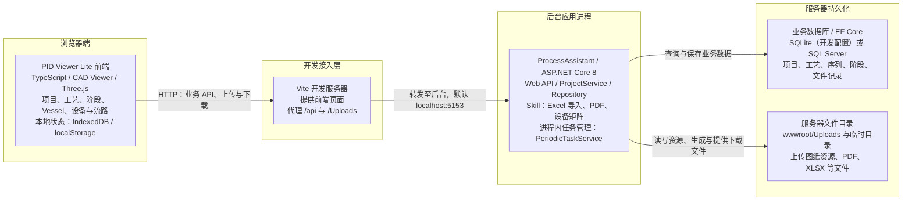

# PID Viewer 系统架构

核对日期：2026-09-24。依据 PIDViewerLite 前端及同级 ProcessAssistant 后台源码整理，描述当前实现，不代表生产环境部署验收结果。

## 系统架构图

[在 FigJam 中查看和编辑架构图](https://www.figma.com/board/G9L27nxfdqBCGo9zNzHz1h)

当前系统采用浏览器前端与 ASP.NET Core 单体后台分离的架构。前端负责工艺交互、CAD 显示及标注；后台负责业务数据持久化、文件管理、Excel 导入和业务报告生成。

下图展示当前开发配置的部署边界。箭头表示请求、路由或存储访问方向，响应沿原调用链返回。

图中一个应用节点对应一个运行单元。Skill 和任务管理器都在后台应用进程内，不是独立微服务，也没有将其画成外部消息队列。

## 模块职责

| 层次 | 主要模块 | 职责 |
| --- | --- | --- |
| 前端工作区 | 图纸库、Project、工艺侧栏、报告工作区 | 浏览和编辑业务对象，组织操作流程，展示结果 |
| 前端图纸引擎 | CAD Simple Viewer、数据模型、Three.js 渲染 | 加载图纸，显示设备与管线，支持定位、浏览和阶段高亮 |
| 前端阶段状态 | PhaseWorkspaceStore、PhasePresentationController、Vessel 定位 | 管理当前阶段上下文，恢复和展示设备状态、流路与标注 |
| 前端服务适配 | ProcessAssistantClient、各业务 API、Repository 适配器 | 将界面模型转换为后台请求，处理 JSON、FormData 和文件响应 |
| 浏览器本地存储 | DrawingAssetStore、IndexedDB、localStorage | 保存部分图纸资源、选中项目及界面状态；不替代后台业务数据库 |
| 后台业务接口 | Project、Procedure、Operation、Phase 控制器 | 提供项目、工艺结构和阶段数据接口 |
| 后台文件接口 | FileController、静态文件中间件 | 接收上传文件、维护文件记录、提供下载和资源访问 |
| 后台业务组装 | ProjectService、ProjectModel、ProcessDrawingInfo | 按选定项目和阶段组织业务模型与图纸数据，供导入及报告处理使用 |
| 后台任务执行 | SkillController、PeriodicTaskService、InMemoryTaskListProvider | 接收耗时任务，返回任务 ID，在进程内执行并保存任务结果供查询 |
| 后台报告能力 | FlowPathDiagram、ValveMatrix | 基于阶段数据生成流路 PDF 和设备矩阵；使用 PDFsharp、MiniExcel 等组件 |
| 后台数据访问 | Repository、AppDbContext、EF Core | 访问 SQLite 或 SQL Server，持久化业务数据及文件元数据 |

## 业务层级映射

界面名称和后台模型名称并不完全相同，联调和维护时需按下表对应。

| 前端界面 | 后台模型／接口 | 含义 |
| --- | --- | --- |
| Project | Project | 客户或工程项目 |
| Process | Procedure | 工艺任务 |
| Sequence | Operation | 工艺序列 |
| Phase | Phase | 具体阶段 |

因此，界面的 `Project → Process → Sequence → Phase` 对应后台的 `Project → Procedure → Operation → Phase`，不能仅凭名称将两套层级混用。

## 关键数据流

### 图纸上传与查看

1. 浏览器通过文件 API 上传资源。
2. 后台将文件写入服务器目录，并通过仓储保存文件元数据。
3. 前端获取资源信息并请求文件；当前实例使用 PDI 资源，前端包含 PDI 解包入口。
4. 浏览器 CAD 引擎加载并显示图纸，工作区关联阶段状态与高亮。

文件接口本身不能证明后台具备任意 DWG/DXF 的自动解析能力。浏览器临时打开 CAD 文件与上传后台图纸资源是不同路径。

### 工艺编辑与阶段保存

1. 工作区选择 Project、Process、Sequence、Phase。
2. 前端适配器将业务操作映射为 Project、Procedure、Operation、Phase API 请求。
3. 后台通过服务／仓储及 EF Core 查询或保存数据。
4. 返回的数据更新前端阶段状态与 CAD 显示；浏览器本地缓存不是业务保存成功的依据。

### Excel 导入与业务报告导出

1. Excel 配置通过通用 Skill 接口提交，`procedure-configuration` 分支调用项目导入逻辑。
2. PDF 和矩阵分别调用 `POST /api/v1/Skill/flow-path`、`POST /api/v1/Skill/valve-matrix`，提交项目和阶段选择范围。
3. 后台组装项目模型，注册进程内任务并返回任务 ID。
4. FlowPathDiagram 使用图纸区域的 PDF 附件及阶段设备、流路和文字标注生成报告；ValveMatrix 使用 MiniExcel 生成 XLSX。
5. PDF／矩阵导出通过对应的 `result?id=...` 接口查询结果，再按返回的 URL 下载文件。Excel 导入入口当前在提交成功后刷新工作区，未在该入口实现任务完成轮询；返回任务 ID 不等于导入已完成。

业务报告主链路由后台生成，不应与仓库中的浏览器端通用 CAD PDF/SVG 插件混为一条导出路径。图中仅标注已确认的输出；界面上的格式或合并选项是否被后台完整执行，需要另行核验。

## 部署与边界

- 开发模式：Vite 为前端提供页面，代理 `/api` 和 `/Uploads`；后台目标默认为 `http://localhost:5153`，可通过环境配置调整。
- 非开发部署：Vite 开发代理不是生产必需组件。需明确静态前端托管位置，并为 API 与文件 URL 配置可达路径；后台已启用 `wwwroot` 静态文件服务。
- 数据库：开发配置选择 SQLite；代码另支持 SQL Server，两者是配置选项，不是同时运行的双数据库架构。
- 任务状态：当前任务列表使用进程内存；不能据此承诺应用重启后的任务恢复或跨实例共享。
- 认证：当前前端入口接入演示 AuthService，受开发模式／演示开关控制。本图不将 SSO、统一身份平台或完整生产权限体系标为已实现组件。
- 系统定位：用于工程配置、显示和报告，不将 PLC/DCS 现场控制链路画入当前已确认架构。

## 代码依据

前端关键入口：

- [启动与认证入口](../packages/cad-simple-viewer-example/src/start.ts)
- [工作区与 API 组装](../packages/cad-simple-viewer-example/src/main.ts)
- [开发代理配置](../packages/cad-simple-viewer-example/vite.config.ts)
- [HTTP 客户端](../packages/cad-simple-viewer-example/src/api/processAssistantClient.ts)
- [阶段模型适配](../packages/cad-simple-viewer-example/src/phase/phaseWorkspaceRepository.ts)
- [业务报告 API](../packages/cad-simple-viewer-example/src/api/processAssistantExportApi.ts)
- [本地图纸资源存储](../packages/cad-simple-viewer-example/src/phase/drawingAssetStore.ts)

后台来源为同级 ProcessAssistant 仓库，核对的核心符号包括：

- `Program.Main`：ASP.NET Core 服务注册、数据库初始化、静态文件服务及控制器映射。
- `EfCoreServiceCollectionExtensions.AddEfCoreServices`：数据库类型选择、DbContext 和仓储注册。
- `FileController.Upload`：文件落盘与元数据保存。
- `SkillController.GeneralSkill / StartFlowPathDiagram / StartValueMatrix`：Excel 导入、报告任务创建与结果查询。
- `PeriodicTaskService.AddTask`：进程内任务注册；`InMemoryTaskListProvider` 在应用启动时注册。
- `FlowPathDiagram.DoWork / ValveMatrix.DoWork`：PDF 与矩阵生成。

本次仅整理架构文档，未修改前后端代码或现有 Word 手册；未执行上传、导入、报告生成等业务写入验证。